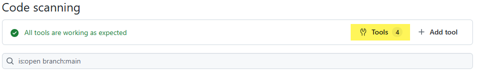
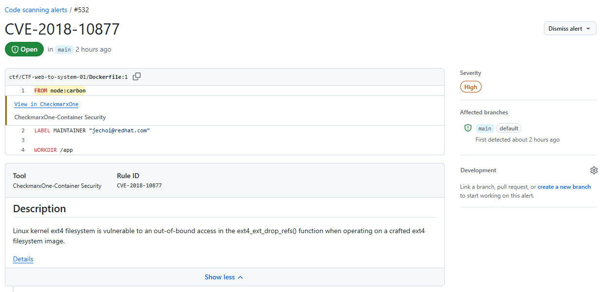

# SARIF v2.1.0 Python Module for CheckmarxOne

This is a Python 3.9+ module for generating SARIF logs for scans from CheckmarxOne.

It can be executed as a command line application or integrated into your own applications via the
module's API.  The generated SARIF log file is designed to align closer with the SARIF standard than
the SARIF logs output by the CheckmarxOne CLI.

## Features

* Generates one SARIF `Run` entry per scan engine.
  * SAST with detected API Security results
  * SCA with detected Exploitable Path results
  * KICS
  * Container Security
* A command-line interface is available that can generate SARIF logs in files for one or more scan ids.
* The module API can be used to integrate SARIF log generation into your own applications.
* Can be used with CheckmarxOne single- or multi-tenant environments.

## Installing

The module can be installed manually the URL for the install `.whl` file from the Releases:

```Bash
pip install https://github.com/checkmarx-ts/cxone-sarif/releases/download/X.X.X/cxone_sarif-X.X.X-py3-none-any.whl
```

## Using the API

The `__main__.py` file is a good example of using the `cxone_sarif` module.  The basics:

```Python
import cxone_api as cx
from cxone_sarif import get_sarif_v210_log_for_scan
from cxone_sarif.opts import DEFAULT

# Create an instance of the cxone-async-api client
client = cx.CxOneClient.create_with_XXXX(...)
sarif_log = await get_sarif_v210_log_for_scan(client, DEFAULT, "<scan id>")
```

## Using the Command Line

Execute the `cxone-sarif` CLI to display the help:

```Bash
cxone-sarif -h
```

This help documentation is displayed:

```Console
Usage: cxone-sarif [-h | --help | -v | --version] --tenant TENANT (--region REGION | (--url URL --iam-url IAMURL)) 
                   (--api-key APIKEY | (--client OCLIENT --secret OSECRET) | --use-env-oauth | --use-env-api-key) 
                   [--level LOGLEVEL] [--log-file LOGFILE] [--timeout TIMEOUT] [--retries RETRIES] [--proxy IP:PORT] 
                   [--outdir OUTDIR] [--no-sast] [--no-sast-apisec] [--no-sca] [--no-kics] [--no-containers] [-qk] [-t THREADS] SCANIDS... 

  SCANIDS...          One or more space-separated scan ids that will each generate a file containing a SARIF log.

  -h --help           Show this help.

  -v --version        Show version and exit.

  --tenant TENANT     The name of the tenant for use with the specified CheckmarxOne service endpoint.
                
  Multi-Tenant CheckmarxOne options:
  --region REGION     The multi-tenant region where the tenant is hosted.
                      Use one of: US,US2,EU,EU2,DEU,ANZ,India,Singapore,UAE

  Single-Tenant CheckmarxOne options:
  --url URL           The URL for the single-tenant CheckmarxOne portal.
  --iam-url IAMURL    The URL for the single-tenant CheckmarxOne IAM endpoint.

  Authorization Options:

  --api-key APIKEY    The API key to be used for authentication.
  --use-env-api-key   Retrieve the API key from the environment variable CX_APIKEY.

  --client OCLIENT    The name of the OAuth client to be used for authentication.
  --secret OSECRET    The OAuth secret associated with the OAuth client.
  --use-env-oauth     Retrieve the OAuth credentials from the environment variables CX_OCLIENT and CX_OSECRET.

  -- Additional Options --

  CheckmarxOne API Options
  --timeout TIMEOUT   The timeout, in seconds, for API operations.  [default: 60]

  --retries RETRIES   The number of operation retries on failure.   [default: 3]

  -k                  Ignore SSL verification failures. 

  --proxy IP:PORT     A proxy server to use for communication.

  
  SARIF Log Generation Options:
  --no-sast           Suppress static code analysis scan results.
  --no-sast-apisec    Do not augment SAST results with API security scan results.

  --no-sca            Suppress software composition analysis scan results.
  
  --no-kics           Suppress infrastructure as code scan results.
  
  --no-containers     Suppress container security scan results.
  
  --outdir OUTDIR     Directory where to write the SARIF log files.   [default: .]

  -t THREADS          The number of concurrent scan report generations.  [default: 2]
                      Keep at 2 when using with multi-tenant Checkmarx One for
                      best stability.  The maximum is 8.

  Logging Output Options:
  --level LOGLEVEL    Log level [default: INFO]
                      Use: DEBUG, INFO, WARNING, ERROR, CRITICAL
  
  --log-file LOGFILE  A file where logs are written.

  -q                  Do not output logs to the console.
```

An example minimal command line when the OAuth credential environment variables are defined:

```Bash
cxone-sarif \
  --tenant {your tenant name} \
  --region {your region} \
  --use-env-oauth \
  10253e85-2d70-450e-bc5d-9e54dc5f10c5 97068a6d-f2fa-4047-bea1-bd74df3a4059
```

Upon completion, the files `10253e85-2d70-450e-bc5d-9e54dc5f10c5.sarif` and `97068a6d-f2fa-4047-bea1-bd74df3a4059.sarif` are written
in `./` (the default output path), each containing a SARIF log with a `Run` for each scan engine executed for the scan.

### Handling Errors with the CLI

The CLI emits shell exit codes on completion:

|Code|Meaning|
|-|-|
|0|Successful completion|
|1|General failure with no SARIF logs generated|
|100|Partial failure with one or more SARIF logs failing to complete|

When a SARIF log fails, the details are emitted in the log.  The scan id for each
failed log is emitted on `stderr` and can be captured by piping `stderr` output
to a file.

An example where the failed scan ids are written to `failures.txt`:

```Bash
cxone-sarif \
  --tenant {your tenant name} \
  --region {your region} \
  --use-env-oauth \
  10253e85-2d70-450e-bc5d-9e54dc5f10c5 97068a6d-f2fa-4047-bea1-bd74df3a4059 2> failures.txt
```

# Use with GitHub Code Scanning

The primary testing platform for the Sarif was to use the [Sarif Web Validator](https://sarifweb.azurewebsites.net/Validation) along with [GitHub's code security](https://docs.github.com/en/code-security/code-scanning/integrating-with-code-scanning/uploading-a-sarif-file-to-github).  Other platforms that can ingest Sarif
can likely use the Sarif to achieve similar results.

When the Sarif file is imported, the tools used for scanning are noted at the top of the alert list.



Drilling into the tools link shows the list of tool that reported alerts.


Each tool has a "Setup Type" view.


The details view can show an enumeration of result uploads, each having the details:

* Checkmarx One Project Id.
* Checkmarx One Scan Id.
* Checkmarx One engine version.
* A downloadable CSV of issues reported by this engine.


## SAST Results View

A SAST result will have the result summary and description of the issue.  If a data flow is available, the "Show Paths" link will open a window that allows traversal of the nodes in the data flow.


The data flow will show the code snippets from source to sink, similar to the Checkmarx One triage display.


If there is an API Security result associated with the SAST example, the API security endpoints will be enumerated in the result summary.


## SCA Results View

The SCA results will show the manifest file that references the vulnerable package along with the CVE description.


If exploitable path results were detected, hints are displayed in the result summary.  The "Show Paths" link will open a display showing
the location in the code where the package may be referenced.


## Container Security Results View

The container security results will show the file where the result has been
detected.  A brief description of the CVE is also provided.



## KICS Results View

The KICS results will show the file where the result has been
detected.  A brief description of the detected issue is also provided.


